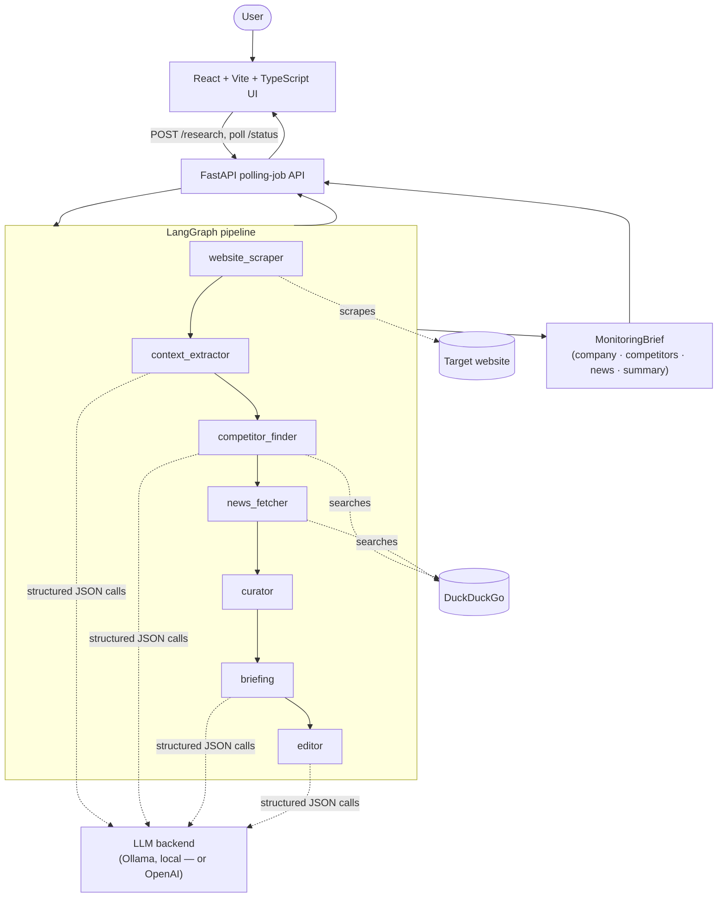

#  Competitive Intelligence Pipeline

An autonomous agent pipeline that turns a single company URL into a structured
competitor-and-news monitoring brief — no manual research required.

🎥 **Demo**

https://github.com/user-attachments/assets/2f666fc6-9b89-4ba4-926e-27114c9f68ae

##  The Problem & Business Value

Competitive research is repetitive manual work: find out what a company does, figure out
who its real competitors are, then trawl the web for recent news about all of them. This
project automates the whole chain. Give it a URL and it autonomously:

1. Scrapes the site and extracts the business's domain, target audience, and value proposition.
2. Identifies 3–5 real competitors from live web search, with a reason for each.
3. Fans out news search across the company, every competitor, and the industry.
4. Deduplicates and curates the results.
5. Summarizes each category, then assembles one structured, LLM-written monitoring brief.

The whole run is triggered by one API call and polled to completion — a person's part in
the loop is typing a URL and reading the result.

##  Architecture



Every external dependency (scraper, search, LLM) sits behind its own Python `Protocol`
(`app/ports/`), so the graph is testable without any real network calls, and the LLM
provider has been swapped three times (OpenRouter → Gemini → Ollama/OpenAI) without
touching a single graph node.

##  Tech Stack

| Layer | Technology |
|---|---|
| Agent orchestration | LangGraph — 7-node graph, each node a pure `State -> State` function |
| Website scraping | crawl4ai (LLM-ready markdown output) |
| Web search | DuckDuckGo (`ddgs`), behind an interface swappable for SearXNG |
| LLM | **Ollama** (local, default — `qwen2.5:3b`) or **OpenAI** (`gpt-5-mini`), auto-selected by whether `OPENAI_API_KEY` is set |
| Backend | FastAPI (async, background-task polling job) |
| Frontend | React + Vite + TypeScript + Tailwind CSS |
| Domain models | Pydantic v2 (contract-tested) |
| Resilience | tenacity-based retry/backoff, tuned per LLM backend |
| Logging | structlog (structured, per-node start/finish/failure events) |
| Tests | pytest + pytest-asyncio — 92 tests, zero real network calls |

##  Key Features

- **Ports & adapters architecture.** Every graph node depends only on a `Protocol`
  (`WebScraper`, `WebSearch`, `LLMClient`), never a concrete implementation — proven by
  swapping the LLM provider three times over the course of this project with zero changes
  to business logic.
- **Automatic LLM backend selection.** Runs fully free and offline against a local Ollama
  model by default; drops in OpenAI transparently the moment an API key is present, for
  users without a local GPU or Ollama installed.
- **Schema-constrained structured output.** Every LLM call that needs structured data uses
  native JSON-schema-constrained decoding (not prompt-and-hope), which is what makes small,
  free/local models usable here at all.
- **Graceful degradation.** Each node can fail independently — a failed competitor search
  doesn't take down news fetching or the final brief; failures are tracked as explicit state
  flags and the API surfaces a real `error` status instead of silently returning nothing.
- **Tuned resilience per backend.** Retry/backoff is calibrated to each provider's actual
  failure mode: long patient backoff for cloud rate limits, no artificial timeout at all for
  local inference (where latency is unpredictable but there's no quota to protect).
- **Fully mocked test suite.** Contract tests for every domain model, unit tests for every
  node and adapter against fakes/mocks, and integration tests for the full graph and API —
  CI never makes a real network call.

##  Results

- **Verified end-to-end against real, live websites** (including non-English, e-commerce-heavy
  pages), producing a complete `MonitoringBrief`: company profile, 3–5 competitors, curated
  news tagged by entity, and an LLM-written markdown summary.
- **92 automated tests, 100% passing**, `ruff` and `mypy --strict` clean.
- **A production-grade reliability journey, not just a demo.** Along the way this surfaced
  and fixed a real API bug (a job could report `"done"` with no brief when extraction
  failed, instead of `"error"`), and required diagnosing three distinct classes of LLM
  failure in production — a third-party shared-pool rate limit, a per-key cloud quota, and
  local-hardware latency — each fixed at the right layer (schema-constrained decoding,
  provider-specific backoff tuning, and a no-timeout policy, respectively) rather than
  papered over.
- **Full pipeline run completes in under two minutes** end-to-end (scrape → extract →
  find competitors → fetch news → curate → summarize → edit) once a local model is warm.

##  Quick Start

```bash
git clone <this-repo>
cd Automated-Competitor
uv sync --all-groups        # install dependencies

# Pick ONE LLM backend:
winget install --id Ollama.Ollama -e && ollama pull qwen2.5:3b   # local, free
# --- or ---
echo "OPENAI_API_KEY=sk-..." >> .env                             # cloud, no local install

uv run uvicorn app.api.main:app --reload   # terminal 1 — backend
cd frontend && npm install && npm run dev  # terminal 2 — frontend
```

Open the printed frontend URL, enter a company website, and watch the pipeline run.

## Repository layout

```
app/
├── domain/    # Pydantic data models
├── ports/     # Protocol interfaces for external services
├── adapters/  # port implementations (crawl4ai, duckduckgo, ollama, openai)
├── graph/     # LangGraph nodes and graph assembly
├── jobs/      # job storage
└── api/       # FastAPI routes
frontend/      # React + Vite + TypeScript UI
tests/
├── unit/          # nodes and adapters with mocks/fakes
├── integration/   # full graph, API endpoints
└── contract/      # Pydantic model validation
scripts/           # manual smoke tests (not run in CI)
```

## Development

```bash
uv sync --all-groups   # install dependencies
uv run pytest          # run tests
uv run ruff check .    # lint
uv run mypy app        # type check
```

CI (`.github/workflows/ci.yml`) runs lint + mypy + pytest on every push and pull request.

`OLLAMA_MODEL` / `OLLAMA_HOST` and `OPENAI_MODEL` in `.env` are optional overrides — see
`.env.example`. Vite's dev server proxies `/research*` requests to `http://localhost:8000`,
so the frontend needs no CORS configuration. This is a local dev-only setup — there's no
production bundling/serving story yet.

Full specification and phased development plan: [spec_and_plan.md](spec_and_plan.md).
